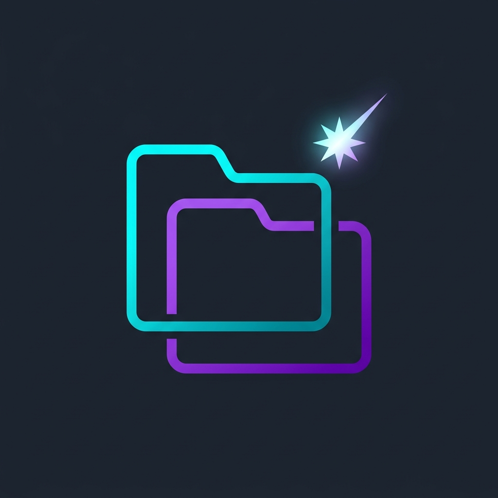

# 2ManyTabs MCP


<div align="center">



[](https://github.com/jamubc/2manytabs-mcp/releases)
[](https://www.npmjs.com/package/2manytabs-mcp-host)
[](https://www.npmjs.com/package/2manytabs-mcp-host)
[](https://opensource.org/licenses/MIT)

</div>

> List, group, deduplicate, and bulk-close browser tabs with natural language, from any MCP client.

A Chrome extension acts as a thin proxy for `chrome.tabs`. A Node.js MCP host handles all the logic (filtering, grouping, dedup) and talks to your AI client over stdio. Everything runs locally on loopback.

## Browsers

Works with any Chromium browser:

[](https://www.google.com/chrome/)
[](https://brave.com/)
[](https://www.microsoft.com/edge)
[](https://www.opera.com/)
[](https://www.perplexity.ai/comet)

Firefox and Safari are planned.

---

## Prerequisites

- **[Node.js](https://nodejs.org/) v18+**
- Local port `9876` available

---

## Step 1 · Install the MCP Host

Pick your client below. They all run the same server, just different config locations.

### Verified Clients

<details>
<summary><strong>Claude Code</strong></summary>

```bash
claude mcp add 2manytabs-mcp -- npx -y 2manytabs-mcp-host
```
</details>

<details>
<summary><strong>Claude Desktop</strong></summary>

Add to your config file:

| OS | Path |
|---|---|
| macOS | `~/Library/Application Support/Claude/claude_desktop_config.json` |
| Windows | `%APPDATA%\Claude\claude_desktop_config.json` |
| Linux | `~/.config/claude/claude_desktop_config.json` |

```json
{
  "mcpServers": {
    "2manytabs-mcp": {
      "command": "npx",
      "args": ["-y", "2manytabs-mcp-host"]
    }
  }
}
```

Restart Claude Desktop after saving.
</details>

<details>
<summary><strong>VS Code / GitHub Copilot Chat</strong></summary>

Create `.vscode/mcp.json` in your workspace (or add to your user `settings.json` under `"mcp"`):

```json
{
  "mcpServers": {
    "2manytabs-mcp": {
      "command": "npx",
      "args": ["-y", "2manytabs-mcp-host"]
    }
  }
}
```

See the [VS Code MCP docs](https://code.visualstudio.com/docs/copilot/customization/mcp-servers) for details.
</details>

<details>
<summary><strong>Cursor</strong></summary>

Open **Settings → MCP** and add a new server, or create/edit `.cursor/mcp.json`:

```json
{
  "mcpServers": {
    "2manytabs-mcp": {
      "command": "npx",
      "args": ["-y", "2manytabs-mcp-host"]
    }
  }
}
```
</details>

<details>
<summary><strong>Windsurf</strong></summary>

Open **Settings → Cascade → MCP**, or create/edit `mcp_config.json`:

```json
{
  "mcpServers": {
    "2manytabs-mcp": {
      "command": "npx",
      "args": ["-y", "2manytabs-mcp-host"]
    }
  }
}
```

See the [Windsurf MCP guide](https://windsurf.com/university/general-education/intro-to-mcp) for details.
</details>

<details>
<summary><strong>Continue</strong></summary>

Add to `.continue/config.json` (or create `.continue/mcpServers/2manytabs-mcp.json`):

```json
{
  "mcpServers": {
    "2manytabs-mcp": {
      "command": "npx",
      "args": ["-y", "2manytabs-mcp-host"]
    }
  }
}
```

See the [Continue MCP docs](https://docs.continue.dev/customize/mcp-tools) for details.
</details>

<details>
<summary><strong>Cline</strong></summary>

Open the **MCP Servers** panel in Cline and add a new server:

- **Command:** `npx`
- **Args:** `-y 2manytabs-mcp-host`

Or edit the Cline MCP config JSON directly with the same block used above. See the [Cline MCP docs](https://docs.cline.bot/mcp/mcp-overview) for details.
</details>

<details>
<summary><strong>Hermes Agent</strong></summary>

```bash
hermes mcp add 2manytabs-mcp --command "npx -y 2manytabs-mcp-host"
```

Restart your session (`/reset` or start a new `hermes` invocation), then verify:

```bash
hermes mcp list
hermes mcp test 2manytabs-mcp
```

Config lives at `~/.hermes/config.yaml` under the `mcp` section.
</details>

### Should Also Work

These clients support MCP but we haven't tested them directly. The same JSON config block should work, just drop it into the client's MCP config file:

| Client | Notes |
|---|---|
| [LibreChat](https://docs.librechat.ai/) | MCP agent/tool server support documented |
| [ChatGPT](https://platform.openai.com/docs/mcp) | MCP connectors exist; local stdio flow unverified |
| [Sourcegraph Cody](https://sourcegraph.com/cody) | MCP via OpenCTX; setup syntax unverified |
| [Genkit](https://firebase.google.com/products/genkit) | `genkitx-mcp` plugin can consume MCP servers |
| [Zed](https://zed.dev/) | Tool support is experimental (prompts/resources only in some builds) |

If your client speaks MCP over stdio, it will work. Point it at `npx -y 2manytabs-mcp-host` and you're set.

---

## Step 2 · Load the Browser Extension

1. Go to `chrome://extensions/` (or `edge://extensions/`, `brave://extensions/`, etc.)
2. Enable **Developer mode** (toggle in the top-right)
3. Click **Load unpacked**
4. Select the `extension/` directory from this repo (or the unzipped release)
5. Click the extension icon in the toolbar; the popup should show **Connected** once the host is running

---

## What You Can Say

Just talk to your AI client:

- *"Show me all my open tabs."*
- *"Find and close duplicate tabs."*
- *"Close everything matching 'youtube'."*
- *"Do a dry run of closing all tabs from reddit.com."*
- *"Group my tabs by domain and show the breakdown."*

---

## Tools

The host exposes two tools:

### `list_tabs`

Read-only. Returns a domain histogram with proportional bars and a per-domain listing with titles, pinned, and audible flags.

| Param | Type | Default | Description |
|---|---|---|---|
| `query` | string | - | Substring filter on title or URL |
| `group_by` | `"domain"` · `"window"` · `"none"` | `"domain"` | How to group results |
| `duplicates_only` | boolean | `false` | Show only duplicate URLs |

### `close_tabs`

Closes tabs. Exactly one selection mode required:

| Param | Type | Description |
|---|---|---|
| `tab_ids` | number[] | Close specific tab IDs |
| `match` | string | Close tabs matching this substring |
| `duplicates` | boolean | Close all duplicates (keeps first occurrence) |
| `dry_run` | boolean | Preview what would close without closing |

### `open_tabs`

Opens new tabs in the browser.

| Param | Type | Description |
|---|---|---|
| `urls` | string[] | Array of URLs to open |

---

## Architecture

```
  AI Client ◄──stdio──► MCP Host ──WebSocket :9876──► Browser Extension
                           │
                           ▼
                      Follower Hosts
```

- The extension is a thin proxy (`query` and `close` only). All logic lives in the host, so new capabilities ship without an extension update.
- Multiple AI clients can share one browser. Hosts self-organize: one binds port 9876 (owner), the rest proxy through it (followers). On owner death, followers re-elect automatically.
- The extension reconnects via `chrome.alarms` every 30s (MV3 idle behavior).

---

## Security

- **Loopback only**: the server binds to `127.0.0.1`, not `0.0.0.0`.
- **Origin validation**: only `chrome-extension://` origins can connect. Web pages attempting loopback attacks get rejected with a `4003` close code.
- **No cloud, no daemon**: everything stays on your machine.

---

## Contributing

PRs welcome. Browser support is the biggest gap right now:

[](https://www.mozilla.org/firefox/)
[](https://www.apple.com/safari/)

For a local dev setup, clone the repo and run `bash install.sh`.

## License

MIT, see [LICENSE](LICENSE).
